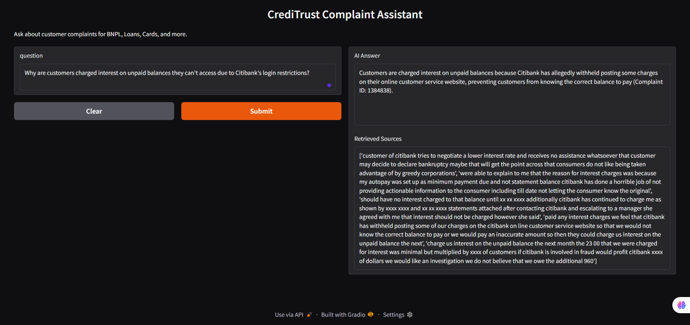

# 🧠 CrediTrust AI Complaint-Answering Chatbot

[](LICENSE)
[](https://www.python.org/)
[](https://www.langchain.com/)
[](https://www.trychroma.com/)

> A Retrieval-Augmented Generation (RAG) system for transforming consumer complaint data into actionable product insights at CrediTrust Financial.

---

## 📌 Table of Contents

- [📊 Business Problem](#-business-problem)
- [🎯 Objectives & KPIs](#-objectives--kpis)
- [💡 Solution Overview](#-solution-overview)
- [🗃️ Dataset](#️-dataset)
- [🛠️ Project Structure](#️-project-structure)
- [🚀 Setup & Installation](#-setup--installation)
- [✅ Tasks Overview](#-tasks-overview)
- [🧪 Evaluation Strategy](#-evaluation-strategy)
- [📷 UI Preview](#-ui-preview)
- [📚 Learning Outcomes](#-learning-outcomes)
- [📄 License](#-license)

---

## 📊 Business Problem

CrediTrust Financial is a rapidly growing East African FinTech provider offering:
- Credit Cards
- Personal Loans
- Buy Now, Pay Later (BNPL)
- Savings Accounts
- Money Transfers

Each month, thousands of unstructured customer complaints are submitted across multiple channels (app, email, regulatory reports), making it hard for internal teams to extract insights or trends.

---

## 🎯 Objectives & KPIs

### 📌 Key Performance Indicators (KPIs):

- ⏱️ Reduce trend detection time from days to minutes  
- 🧑‍💻 Empower non-technical teams (Support, Compliance) to self-serve insights  
- 📈 Enable proactive product fixes through real-time feedback analysis

---

## 💡 Solution Overview

This project delivers a fully functional Retrieval-Augmented Generation (RAG) system that:
- ✅ Accepts plain-English queries (e.g., _"Why are people unhappy with BNPL?"_)
- ✅ Retrieves relevant complaint narratives using semantic search
- ✅ Synthesizes concise answers using an LLM with context
- ✅ Provides multi-product and source traceability
- ✅ Features a **Gradio-powered chatbot** interface for real-time interaction

---

## 🗃️ Dataset

### Source:
[Consumer Financial Protection Bureau (CFPB)](https://www.consumerfinance.gov/data-research/consumer-complaints/)

### Key Fields:
- `Product`, `Sub-product`
- `Consumer complaint narrative`
- `Issue`, `Company`
- `Date received`, `Complaint ID`

---

## 🛠️ Project Structure

```bash
INTELLIGENT-COMPLAINT-ANALYSIS-FOR-FINANCIAL-SERVICES/
├── .env
├── .gitignore
├── Dockerfile
├── docker-compose.yml
├── main.py                     
├── README.md
├── requirements.txt
│
├── data/
│   ├── raw/                    
│   └── processed/
│       └── filtered_complaints.csv  # Cleaned complaint data
│
├── notebooks/
│   ├── 01_eda_preprocessing.ipynb
│   └── 1.0-eda.ipynb
│
├── src/
│   ├── api/
│   │   └── __init__.py
│   ├── credit_rag_assistant.py      # Main class/methods for RAG logic
│   ├── data_processing.py           # Cleaning, formatting, chunking
│   ├── embedding_indexing_chroma.py # Embedding & indexing into ChromaDB
│   └── rag_interface.py             # Gradio interface 
├── tests/
│   └── test_data_processing.py      
│
└── vector_store/
    └── chroma/
        ├── chroma.sqlite3           # Persisted Chroma vector DB
        └── [UUID folder]            # Auto-generated index metadata
```

---

## 🚀 Setup & Installation

### 🔧 Prerequisites

* Python 3.10+
* pip

### 📦 Install Dependencies

```bash
pip install -r requirements.txt
```

### ▶️ Run Embedding Pipeline

```bash
python src/embedding_indexing_chroma.py
```

### 💬 Launch Chatbot UI (Gradio)

```bash
python src/rag_interface.py
```

---

## ✅ Tasks Overview

| Task       | Description                           | Status |
| ---------- | ------------------------------------- | ------ |
| **Task 1** | EDA & data preprocessing              | ✅ Done |
| **Task 2** | Text chunking & vector store indexing | ✅ Done |
| **Task 3** | RAG pipeline: Retrieval + Generation  | ✅ Done |
| **Task 4** | Gradio Chatbot UI                     | ✅ Done |

---

## 🧪 Evaluation Strategy

| Question                                           | Answer                                                                | Top Retrieved Chunks | Score (1–5) | Comments                      |
| -------------------------------------------------- | --------------------------------------------------------------------- | -------------------- | ----------- | ----------------------------- |
| *Why are users unhappy with BNPL?*                 | Delays in refunds, unclear repayment terms, poor customer support     | ✅                    | 4           | Good retrieval but repetitive |
| *What issues are most reported in Personal Loans?* | Unexpected interest hikes, denied applications, misleading promotions | ✅                    | 5           | Precise and insightful        |
| *How often do customers complain about transfers?* | Frequently, especially delays and account mismatches                  | ✅                    | 4           | Add filtering for dates       |

---

## 📷 UI Preview


### ✅ Features:

* ✅ Ask plain-English questions
* ✅ View generated answers
* ✅ See source complaints used to generate response
* ✅ Streamed output with LLM responses
---

## 📚 Learning Outcomes

By building this project, you’ll:

* Build a RAG pipeline combining semantic retrieval and generative models
* Use LangChain, sentence-transformers, and ChromaDB for scalable QA systems
* Learn practical NLP for FinTech use-cases (e.g., customer support, risk analysis)
* Design and deploy an end-to-end LLM app with an intuitive Gradio interface

---

## 📄 License

This project is licensed under the MIT License - see the [LICENSE](LICENSE) file for details.